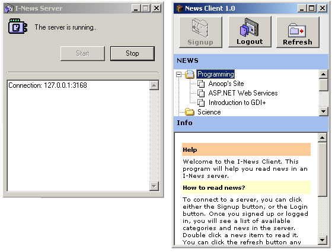



## NewsServer \- A great tutorial that explains how to implement your own protocols \(like HTTP and FTP\)

### Description

Learn Custom Session Layer Protocol Designing : I-News server is a TCP/IP based server-client suit, with limited functionality to serve news over a network. Rather than working as a news server, this application is to demonstrate the designing and implementation of custom application protocols

over TCP/IP. This package contains the Server in the server directory,along with two clients. In the folder ClientGUI, there is a visual client,

and in the folder Client, there is a simple text based client. Download the zip and extract it..
 
### More Info
 

             |
---                |---
**Submitted On**   |2003-05-02 23:30:24
**By**             |[Anoop Madhusudanan](https://github.com/Planet-Source-Code/PSCIndex/blob/master/ByAuthor/anoop-madhusudanan.md)
**Level**          |Intermediate
**User Rating**    |5.0 (35 globes from 7 users)
**Compatibility**  |VB 5\.0, VB 6\.0
**Category**       |[Complete Applications](https://github.com/Planet-Source-Code/PSCIndex/blob/master/ByCategory/complete-applications__1-27.md)
**World**          |[Visual Basic](https://github.com/Planet-Source-Code/PSCIndex/blob/master/ByWorld/visual-basic.md)
**Archive File**   |[NewsServer158248522003\.zip](https://github.com/Planet-Source-Code/anoop-madhusudanan-newsserver-a-great-tutorial-that-explains-how-to-implement-your-own-pro__1-45203/archive/master.zip)

### Source Code

<b>SESSION LAYER DESIGNING:</b>

By Anoop Madusudanan, http://www.inetsindia.com/anoopvision, anoopj13@yahoo.com 
Friday, May 02, 2003 
 
<b>WHY THIS ARTICLE? 
</b> 
To teach you how to design session layer protocols like HTTP and FTP 
(if you are interested ;) ). 
 
Read Readme.htm with this package for a better overview. 
 
The zip file contains 3 projects 
 
a) NewsServer - This project 
b) I-News GUI client - A client with a GUI (in the ClientGUI folder) 
c) I-News Client - A telnet like client (in the Client folder) 
 
 
<b>WHAT IS THIS!!! 
</b> 
I-News server is a TCP/IP based server suit, with limited functionality to 
serve news over a network. Rather than working as a news server, this application 
is to demonstrate the designing and implementation of of custom application protocols 
over TCP/IP. This package contains the Server in the server directory, 
along with two clients. In the folder ClientGUI, there is a visual client, 
and in the folder Client, there is a simple text based client. 
 
<b>AND FINALLY.. 
</b> 
1) Visit my site at http://www.inetsindia.com/anoopvision for more code and tutorials 
2) Give me your vote for this at PSC 
 
Regards, An OOP - anoopj13@yahoo.com 
 

<b>Learn step by step how to..</b>
<ul>
 <li><b>Create TCP/IP based servers and
 clients</b></li>
 <li><b>Implement a proper talking protocol
 between them</b></li>
 <li><b>Send data as chunks through the
 network</b></li>
 <li><b>Use sockets (Winsock) in VB
 applications</b></li>
</ul>

